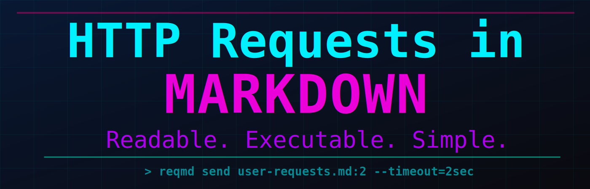
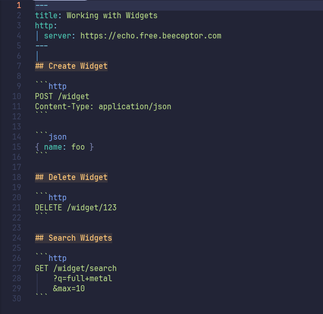
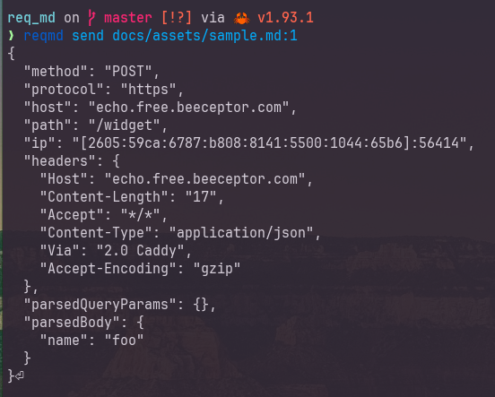
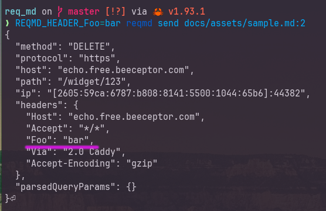
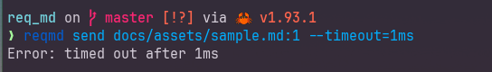
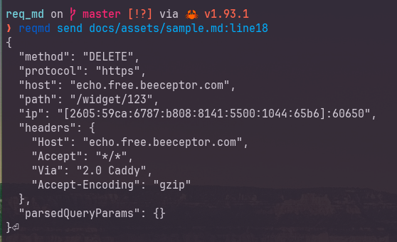
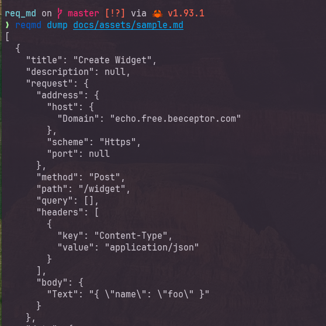

# ReqMD: HTTP Requests in Markdown

This is a project focused on representing a human readable markdown
format which describes HTTP requests. The goal is to be able to create
markdown documents using that specification and leverage this tooling
to identify and send them as valid HTTP requests.

To get started [read the friendly manual].

[read the friendly manual]: https://benfalk.github.io/req_md/

---

**The tl;dr is to be able to take a document like this:**

> Sample document:
> 

**And run commands like this:**

---

> List requests found in the document:
> 

---

> [!Note]
>
> The server in the example is an echo server that replies with
> the information it was sent.  What you are seeing returned
> is the response of that echo server.  This helps demonstrate
> what the details were in the requests this tool sent.

---

> Send first request in the document:
> 

---

> Adds header to request with environment variable:
> 

---

> Can set timeouts _( Examples: 50ms, 2sec, 5min )_
> 

---

> Run by request found at a line number:
> 

---

> Dump requests to JSON:
> 
