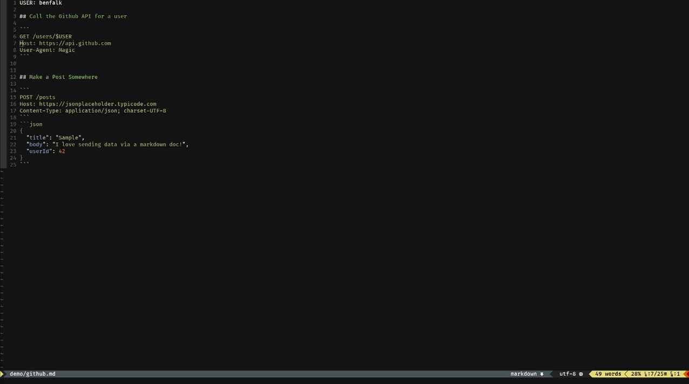

# Request MD



Converts a request formatted with a markdown format into a http request.

For instance the following are valid req_md markdown requests:

### Post with a Content Body

Note: the `json` part of the code block is only for display and linting
of the markdown for readers, it is completely ignored by req_md.

```
POST /widgets
Content-Type: application/json
Host: localhost:3000
```
```json
{
  "name": "foo",
  "type": "mark-1",
  "series": 8
}
```

### Get with a Bunch of URL Parameters

```
GET /filter
      ?zip=90210
      &radius=50
      &colors=red,white,blue
Host: localhost:8080
```

### Add any Headers You Want

```
GET /lifetimes
Content-Type: application/json
X-All-The-Things: it can be whatever here really
R-You-Using-This: again, it can be anything here
Host: localhost:8081
```

### Add in Variables

Any normal line that starts with `VAR:` converts the remaining of the line
into a variable.  Any references to these made as `$VAR` in your request are
expanded to the value on the right hand side value of the colon.  This is a
new and experimental feature that I'm sure has bugs...

For reference see `samples/requests-with-variables.md`

(c) Works on my machine

## Usage

`req_md` works by either a given filename or a piped in string of markdown.
If a filename is given it will ignore any input that is piped from std-in.

Using the file found in `samples/multiple-requests.md` as a reference, if
you want to call the second request found in the markdown here are both
examples:

```bash
cat samples/multiple-requests.md | req_md --line=11

req_md samples/multiple-requests.md:11
```

If you omit the line to use it will run the first valid request it finds.

You can get a debug representation of the request that is going to be run
without running it by supplying the `list-requests` flag.  Here if you
ommit the line number it will output to std-out all of the valid requests
it finds.

**NOTE:** Currently you must include a rather clunky `Host:` header so that
`req_md` knows where to send it's request.  Without it the markdown currently
is not counted as valid markdown.

You can set a timeout in milliseconds, seconds, or minutes in the format
following the examples below:

```
--timeout=300ms
--timeout=15sec
--timeout=2min
```

## Ghetto NeoVim Plugin

This is how I use it with Neovim; I may one day actually spend some time
making it "real" plugin.  Note that mine is expecting the output to always
be JSON and I use `jq` with it.  Also, `req_md` needs to be in your path
with this example.

```vim
function! ReqMd()
  let l:filename = expand('%')
  let l:line_number = line('.')
  let l:arg = l:filename . ":" . l:line_number
  let l:output = system('req_md ' . l:arg . ' | jq .')
  vnew
  call append(0, l:output)
  execute '%s/\%x00/\r/g'
  normal gg
  set filetype=json
  set buftype=nofile
  set noswapfile
endfunction

map <leader>rr :call ReqMd()<cr>
```

## RoadMap

 - [x] Custom Timeouts
 - [ ] Custom Pretty Output Formatters
 - [ ] dotfile Config
 - [x] Variables Support
     - [ ] Harden Variables Support
 - [ ] Session / Cookie
 - [ ] Multiple Requests
