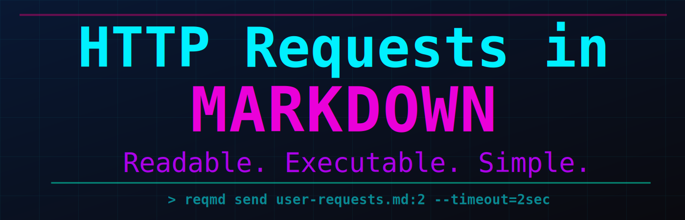

# ReqMD: HTTP Requests in Markdown



This is a project focused on representing a human readable markdown
format which describes HTTP requests. The goal is to be able to create
markdown documents using [that specification] and leverage this tooling
to identify and send them as valid HTTP requests.

[that specification]: https://benfalk.github.io/req_md/reqmd-format.html

## Development Setup

1. Clone the repository

   ```bash
   git clone https://github.com/benfalk/req_md.git
   ```

2. Setup local development environment

   - If you have `just` installed:

   ```bash
   just dev-setup
   ```

   - If you don't have `just` installed (installs `just` as well):

   ```bash
   ./scripts/setup-dev-env.sh
   ```

3. Available Justfile Recipes

   ```text
   default                # lists all recipes
   menu                   # launch interactive menu

   [build]
   build                  # Builds all crates in the workspace
   build-install-cli      # Installs the CLI reqmd
   build-install-tui      # Installs experimental TUI reqmd_tui
   build-rust-docs        # Builds and opens rust crate documentation

   [dev]
   dev-book               # mdbook documentation with hot reloading
   dev-cli COMMAND *ARGS  # Runs dev CLI, rebuilding when needed
   dev-setup              # Setup environment for development
   dev-tui *ARGS          # Runs dev TUI, rebuilding when needed

   [test]
   test *TEST_CASES       # runs quick tests or specific functions
   test-all               # runs all tests, including publish checks
   test-doc-gen           # souce comments documentation
   test-docs              # runs code comment examples as tests
   test-format            # ensures code is formatted correctly
   test-funcs *TEST_CASES # run all or specific tests functions
   test-publish           # checks crates are ready for crates.io
   test-short             # runs quick tests for development
   ```
